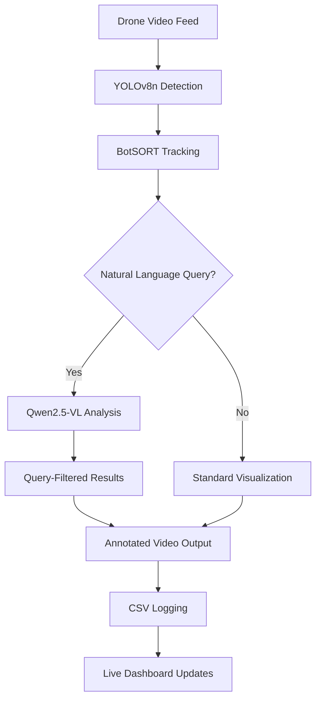

# 🚁 Drone Natural Language Tracker

[](https://salmanfarizn.github.io/drone-nl-tracker/)
[](https://www.python.org/downloads/)
[](https://streamlit.io/)
[](LICENSE)

> **Natural Language-Powered Drone Tracking**: Combine the precision of computer vision with the intuition of human language to track specific objects in drone footage.

## 🌟 Overview

The Drone Natural Language Tracker demonstrates how **Vision Language Models (VLMs)** can revolutionize autonomous systems by enabling natural language control of complex computer vision tasks. This project showcases drone-based object tracking that responds to human queries like "track all blue cars" or "find damaged vehicles" using state-of-the-art AI models.

Built with a fine-tuned **YOLOv8n** model on the VisDrone dataset, **BotSORT tracking**, and **Qwen2.5-VL** for natural language understanding, this system bridges the gap between human intuition and machine precision.

## 🎥 Live Demonstrations

### Standard Object Detection & Tracking


*Baseline tracking using YOLOv8n fine-tuned on VisDrone dataset with BotSORT and ReID for persistent object tracking across frames.*

### Natural Language-Guided Tracking


*Natural language query-based filtering: "Track blue cars" - The system uses Qwen2.5-VL to analyze each detected vehicle and filter results based on the text description.*

## ✨ Key Features

- 🎯 **Natural Language Queries**: Filter objects using intuitive text descriptions
- 🔄 **Real-time Processing**: Live video analysis with immediate visual feedback
- 📊 **Interactive Dashboard**: Streamlit-based UI with dual video displays and live statistics
- 💾 **Experiment Logging**: Automatic CSV logging with timestamped experiment sessions
- 🎨 **Multi-tab Interface**: Separate views for tracking and data analysis
- 🔍 **Persistent Tracking**: BotSORT algorithm maintains object identity across frames
- 🧠 **Vision-Language Integration**: Qwen2.5-VL model for intelligent object categorization

## 🏗️ Architecture



## 🚀 Quick Start

### Prerequisites

- Python 3.13 or higher
- [Ollama](https://ollama.ai/) installed locally
- CUDA-compatible GPU (recommended for optimal performance)

### Installation

1. **Clone the repository**
   ```bash
   git clone https://github.com/SalmanFarizN/drone-nl-tracker.git
   cd drone-nl-tracker
   ```

2. **Install dependencies** (choose one method):

   **Using uv (recommended):**
   ```bash
   uv sync
   uv run streamlit run main.py
   ```

   **Using pip:**
   ```bash
   pip install -r requirements.txt
   streamlit run main.py
   ```

3. **Setup Qwen2.5-VL model**
   ```bash
   ollama pull qwen2.5vl:7b
   ```

4. **Launch the application**
   ```bash
   streamlit run main.py
   ```

   The dashboard will open at `http://localhost:8501`

## 📁 Project Structure

```
drone-nl-tracker/
├── 📄 main.py                 # Streamlit application entry point
├── 📁 src/                    # Core application modules
│   ├── utils.py              # Computer vision utilities
│   ├── tab_tracking.py       # Main tracking interface
│   ├── tab_logs.py           # Data analysis interface
│   └── file_io.py            # CSV logging utilities
├── 📁 models/                 # Pre-trained models
│   ├── yolov8n-VisDrone.pt   # Fine-tuned YOLO model
│   └── botsort.yaml          # BotSORT configuration
├── 📁 data/                   # Video files and logs
├── 📁 assets/                 # Demo GIFs and documentation
├── 📁 docs/                   # Sphinx documentation
├── 📄 pyproject.toml          # Project dependencies (uv format)
└── 📄 requirements.txt        # Dependencies (pip format)
```

## 🎮 Usage Guide

### Basic Tracking
1. Launch the application
2. Navigate to the **🎥 Tracking** tab
3. Click **▶️ Start Detection** to begin processing
4. View live results in the dual video display

### Natural Language Queries
1. Enter your query in the text input (e.g., "blue cars", "red vehicles", "trucks")
2. Click **🔍 Apply Query** or press Enter
3. The system will filter detections based on your description
4. View filtered results in the annotated video feed

### Experiment Management
- **📁 New Log File**: Create a new timestamped experiment session
- **❌ Stop**: Halt processing and clear current query
- **📑 Logs**: View live tracking statistics and data

## 🔧 Technical Details

### Models & Algorithms
- **Object Detection**: YOLOv8n fine-tuned on VisDrone dataset
- **Object Tracking**: BotSORT with Re-Identification (ReID)
- **Vision-Language**: Qwen2.5-VL 7B model via Ollama
- **Video Source**: CARLA 0.9.15 simulation environment

### Performance Considerations
- **GPU Acceleration**: CUDA support for YOLOv8n inference
- **Memory Management**: Efficient frame processing with OpenCV
- **Real-time Processing**: Optimized pipeline for live video analysis

## 📊 Data & Logging

The system automatically logs tracking data to timestamped CSV files:
- **Track ID**: Unique identifier for each detected object
- **Class Information**: Object type and confidence scores
- **Bounding Boxes**: Spatial coordinates for each detection
- **Natural Language Masks**: Query-based filtering results

## 🤝 Contributing

We welcome contributions! Please see our [documentation](https://salmanfarizn.github.io/drone-nl-tracker/) for detailed development guidelines.

### Development Setup
```bash
git clone https://github.com/SalmanFarizN/drone-nl-tracker.git
cd drone-nl-tracker
uv sync --dev
pre-commit install
```

## 📚 Documentation

Comprehensive documentation is available at: **[salmanfarizn.github.io/drone-nl-tracker](https://salmanfarizn.github.io/drone-nl-tracker/)**

## 🔮 Future Enhancements

- [ ] Multi-drone coordination support
- [ ] Advanced query syntax (temporal, spatial constraints)
- [ ] Real-time streaming from live drone feeds
- [ ] Cloud deployment with WebRTC support
- [ ] Integration with additional VLM providers
- [ ] Custom model fine-tuning pipeline

## 📝 License

This project is licensed under the MIT License - see the [LICENSE](LICENSE) file for details.

## 🙏 Acknowledgments

- **VisDrone Dataset**: For providing comprehensive drone imagery data
- **Ultralytics**: For the excellent YOLOv8 implementation
- **Ollama Team**: For making local LLM deployment accessible
- **CARLA Simulator**: For realistic drone simulation environment
- **Qwen Team**: For the powerful vision-language model

---

<div align="center">

**⭐ Star this repository if you find it useful!**

[Documentation](https://salmanfarizn.github.io/drone-nl-tracker/) • [Issues](https://github.com/SalmanFarizN/drone-nl-tracker/issues) • [Discussions](https://github.com/SalmanFarizN/drone-nl-tracker/discussions)

</div>